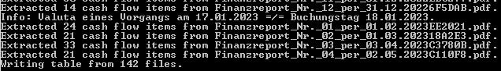
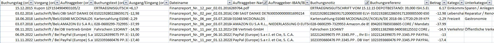

# Kontoauszug-Parser
Dieses Python-Skript extrahiert aus comdirect Finanzreport-PDFs die Girokonto-Umsätze und speichert sie als Tabelle im CSV-Format.

Anhand von Stichwörtern werden die Umsätze simpel kategorisiert. Das smarter zu gestalten ist eine Hoffnung für die Zukunft.
# Installation
Das Skript erfordert eine funktionierende Installation von Python 3 mit den Modulen pandas und pypdf. Der einfachste Weg, diese Umgebung herzustellen, ist der Umgebungsmanager [micromamba](https://mamba.readthedocs.io/en/latest/installation.html).
* Installiere micromamba nach den Anweisungen dort
* `cd pfad\zu\parse-kontoauszug`
* `micromamba create -f environment.yml`
# Ausführung
## Direkt aus der Kommandozeile
* `micromamba activate comdirect-parse`
* Falls die Finanzreport PDFs in demselben Ordner liegen wie das Skript, oder in einem Unterordner: `python parsecomdi.py`
* Falls die Finanzreport PDFs anderswo liegen:  `python parsecomdi.py -p "C:\Pfad\zu\PDFs"`
* Optional kann man mit -o auch den Namen der Ausgabedatei steuern: `python parsecomdi.py -o "girokonto-2023.csv"`
## Per mitgeliefertem Skript
* `run-default.bat` bearbeiten: Die drei Pfade zu python.exe, parsecomdi.py und dem Ordner mit den PDFs durch diejenigen auf dem eigenen System ersetzen
* `run-default.bat` ausführen.
# Ergebnis
Erwartete Ausgabe in der Konsole:


CSV-Ausgabe geöffnet in Excel:

# Weitere Auswertung der Tabelle
## Mit Excel
Excel sollte mit der CSV-Datei wie sie ist arbeiten können. Da das CSV-Format nur simple Tabellen beschreiben kann, bietet es sich für Analysen natürlich an, die weitere Arbeit stattdessen im XLSX-Format abzuspeichern.
## Mit Pandas
Die Tabelle wird um zu Excel nett zu sein im Windows-Encoding gespeichert. Das muss man Pandas explizit angeben:
```
import pandas
df = pandas.read_csv("girokonto.csv", encoding="cp1252", header=0, sep=";")
print(df) # mach was du willst damit
```